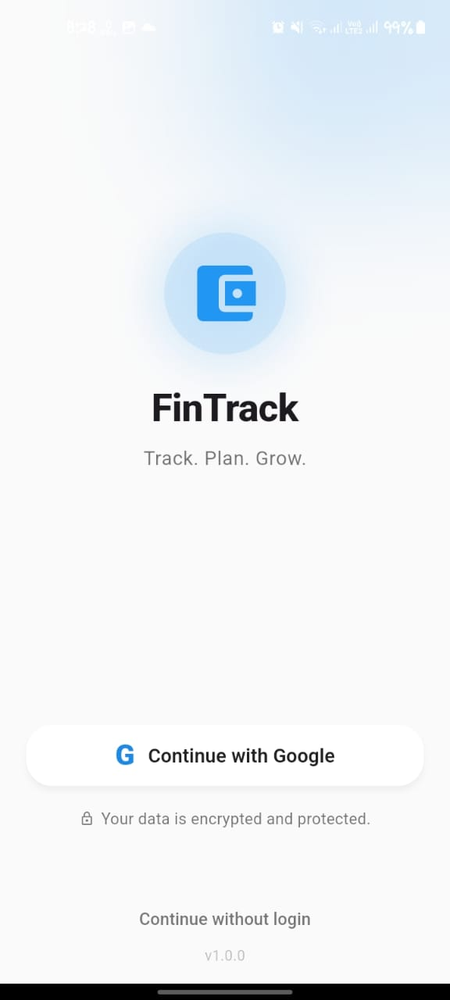
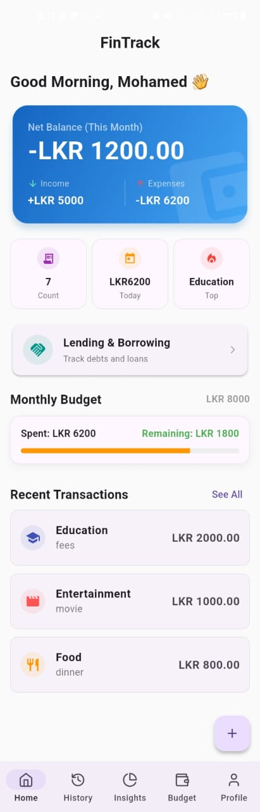
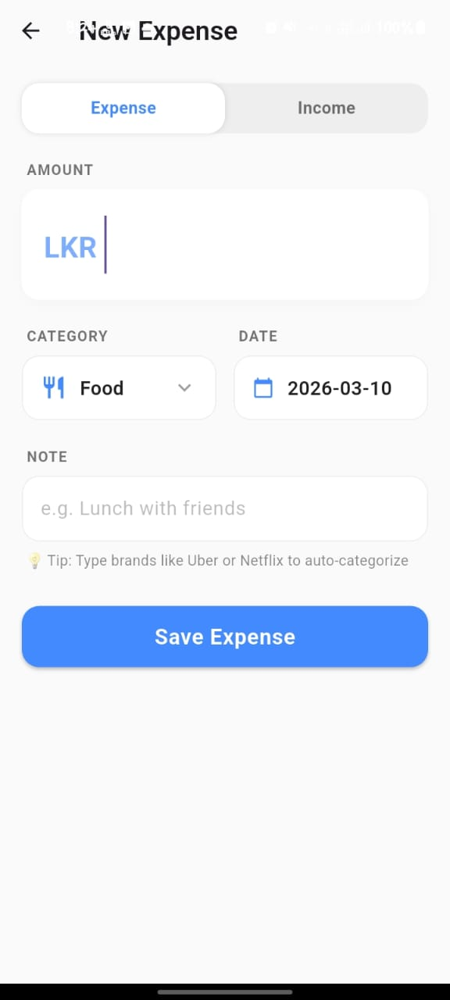
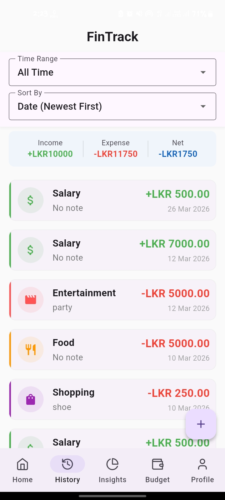
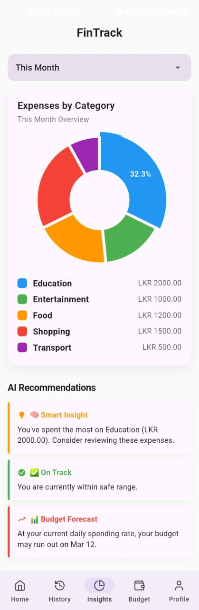
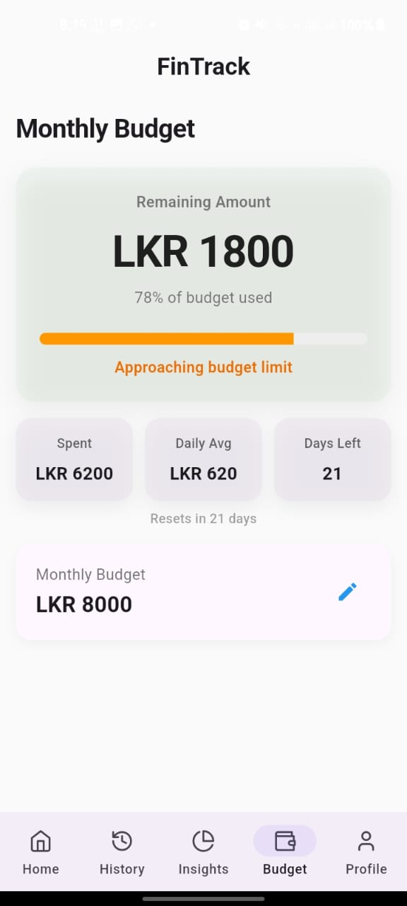
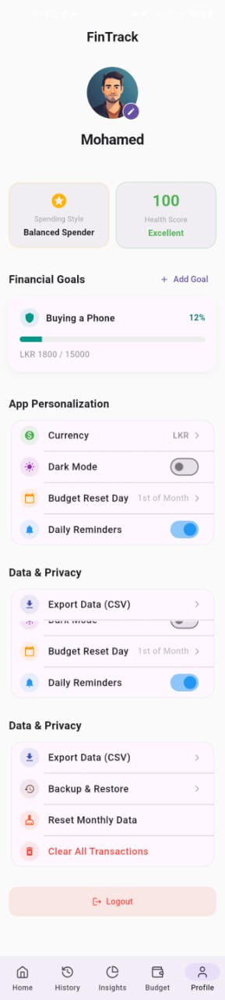
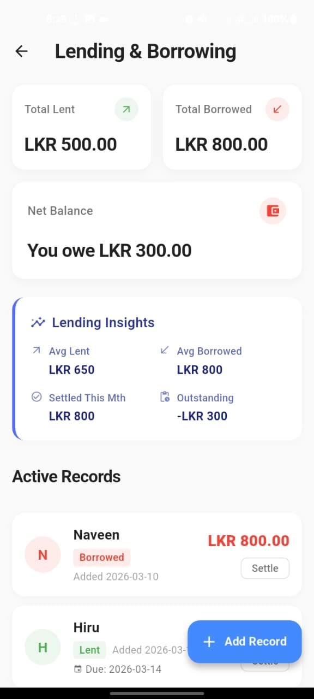

# 💰 FinTrack – Smart Expense Manager

FinTrack is a **modern Flutter-based personal finance application** that helps users track daily income and expenses, manage budgets, analyze spending habits, and monitor personal debts.
The app combines **clean UI, intelligent automation, and insightful analytics** to provide a smooth and smart financial tracking experience.

Built using **Flutter + Firebase**, FinTrack delivers real-time cloud data storage, secure authentication, and interactive visual insights.

---

# 📸 App Screenshots

<h3>Login</h3>


<h3>Dashboard</h3>


<h3>Add Transaction</h3>


<h3>Transaction History</h3>


<h3>Spending Insights</h3>


<h3>Budget Management</h3>


<h3>Profile</h3>


<h3>Lending & Borrowing</h3>


---

# 📱 App Features

## 🔐 Authentication

* **Google Sign-In** – Secure one-tap login using Firebase Authentication.
* **Guest Mode** – Users can access the full app anonymously using Firebase Anonymous Authentication without creating an account.

---

# 📊 Dashboard

The dashboard provides a **quick overview of the user’s financial activity**.

Features include:

* **Dynamic Welcome Message** displaying the user’s Google profile name.
* **Monthly Financial Summary** showing the total income, expenses, and net balance for the current month.
* **Quick Statistics**

  * Total transactions
  * Today's spending
  * Top spending category
* **Recent Transactions Preview** displaying the latest 3 expenses.
* **Bottom Navigation Bar** for seamless navigation between core sections.

---

# 💳 Income & Expense Management

## Add Transaction System

FinTrack offers a **smooth and intuitive entry experience for both income and expenses**.

Key features:

### Category Selection Grid

Instead of a traditional dropdown, users select categories using a **custom grid layout with icons** for faster selection.

### Smart Amount Input

* Automatically adds **currency prefix** (`LKR` or `USD`)
* Formats numbers with commas while typing
  Example:

```
LKR 4,500.00
```

### AI Auto-Categorization

FinTrack automatically detects the best category while typing notes.

Example keyword detection:

| Keyword               | Category      | Type    |
| --------------------- | ------------- | ------- |
| Uber, Taxi, Bus       | Transport     | Expense |
| Lunch, Dinner, Coffee | Food          | Expense |
| Netflix, Movie        | Entertainment | Expense |
| Salary, Paycheck      | Salary        | Income  |
| Dividend, Interest    | Investment    | Income  |

When detected:

* Category auto-selects
* ✨ **Auto badge appears**
* **Haptic feedback** is triggered

### Premium Save Flow

Saving a transaction includes smooth micro-interactions:

* Button **scale animation**
* **Haptic feedback**
* **Success snackbar**
* **Fade transition back to dashboard**

---

# 📜 Transaction History & Filters

Users can easily browse and analyze their past financial activity.

Features include:

### Time Filtering

Filter expenses by:

* Today
* This Week
* This Month
* Last Month
* All Time

### Sorting Options

Sort expenses by:

* Date (Newest → Oldest)
* Date (Oldest → Newest)
* Amount (High → Low)
* Amount (Low → High)

### Dynamic Total Calculation

The displayed total amount **updates instantly** based on the selected filter period.

### Consistent UI Styling

Each transaction item includes:

* Category icon
* Colored category border
* Amount highlight
* Date and notes

---

# 📉 Monthly Budget Management

FinTrack allows users to **define and track a monthly budget**.

### Budget Features

* Set custom **monthly budget limit**
* **Remaining balance calculation**
* **Spent amount tracking**

### Visual Budget Indicator

A dynamic progress bar changes color based on usage:

| Budget Usage      | Indicator |
| ----------------- | --------- |
| Safe              | Green     |
| Approaching Limit | Orange    |
| Budget Exceeded   | Red       |

---

# 📊 Spending Insights

FinTrack includes a dedicated analytics screen for **understanding spending habits**.

### Interactive Pie Chart

Displays spending distribution by category (expenses only).

Features:

* Touch interactions
* Category highlighting
* Animated transitions

### Time Period Analysis

Users can analyze spending for:

* This Month
* Last Month
* All Time

### Smart Insights Engine

FinTrack analyzes the selected period and generates insights such as:

* Highest spending category
* Budget warnings
* Spending patterns

Example insights:

* *“Food accounts for 45% of your monthly spending.”*
* *“You are approaching your monthly budget limit.”*

---

# 🤝 Lending & Borrowing Tracker

FinTrack also helps users track **personal debts between friends and family**.

### Debt Recording

Users can log:

* Money **lent**
* Money **borrowed**
* Optional **due date**

### Active vs Settled Records

Records are divided into:

* **Active debts**
* **Settled history**

### Overdue Detection

If the due date passes, the record automatically displays an **OVERDUE indicator**.

### Net Balance Calculation

The app calculates whether the user:

* **Owes money**
* **Is owed money**

The UI adapts with:

* Soft **green background** when positive
* Soft **red background** when negative

### Lending Insights

Analytics card displaying:

* Most frequent borrower
* Average loan size
* Total settled this month
* Outstanding balance

---

# 🔔 Notifications

FinTrack includes **daily reminder notifications**.

Feature:

* Local push notification at **8:00 PM daily**
* Reminds users to log their expenses

Powered by:

* `flutter_local_notifications`
* `timezone` support for accurate scheduling

---

# 🎨 Customization & Settings

Users can personalize the app experience.

### Dark / Light Mode

Toggle between themes instantly.

The selected theme is **persisted locally**.

### Currency Switching

Users can switch between:

* **LKR**
* **USD**

All values across the app update automatically.

---

# 🛠️ Technical Stack

## Core Technologies

| Technology              | Purpose                     |
| ----------------------- | --------------------------- |
| Flutter                 | Cross-platform UI framework |
| Firebase Authentication | Secure login                |
| Cloud Firestore         | Cloud database              |
| Dart                    | Programming language        |

---

# ⚙️ State Management & Architecture

FinTrack uses a **lightweight and scalable architecture**.

### Provider

The `provider` package is used for global state management.

Example usage:

* Theme switching
* Currency changes
* UI updates across screens

### Stateful Widgets

Used for:

* Local UI states
* Loading indicators
* Filters and dropdown selections

---

# 💾 Data Storage

### Cloud Firestore

User data is securely stored in:

```
users/{uid}/transactions
```

Benefits:

* Real-time updates
* Cloud backup
* User data isolation

### Local Storage

`shared_preferences` is used to store:

* Theme preference
* Selected currency

---

# 📦 Key Packages Used

| Package                     | Purpose                          |
| --------------------------- | -------------------------------- |
| firebase_core               | Firebase initialization          |
| firebase_auth               | User authentication              |
| cloud_firestore             | Database                         |
| google_sign_in              | Google login                     |
| provider                    | State management                 |
| shared_preferences          | Local storage                    |
| fl_chart                    | Pie chart analytics              |
| intl                        | Currency & date formatting       |
| flutter_local_notifications | Reminder notifications           |
| timezone                    | Accurate notification scheduling |

---

# ✨ UI / UX Highlights

FinTrack focuses heavily on **modern mobile UX**.

Features include:

* Material 3 design
* Smooth micro-interactions
* Animated transitions
* Haptic feedback
* Responsive layouts
* Clean card-based design system

---

# 🚀 Future Improvements

Potential enhancements planned for future versions:

* Receipt scanning using OCR
* Spending prediction
* Multi-device synchronization
* Export reports to PDF
* AI-powered financial insights

---

# 📦 Key Features Added

* **Advanced CSV Exporting**: Generate fully structured monthly financial reports from the Profile screen, compatible natively with Excel.
* **Modern Visual Design**: Incorporates sleek modern iconography through the `lucide_icons` package.
* **Financial Goal Tracking**: Users can allocate budget pools for goals, tracked directly in their profile screen.

---

# 📄 License

This project is open-source and available under the **MIT License**.
